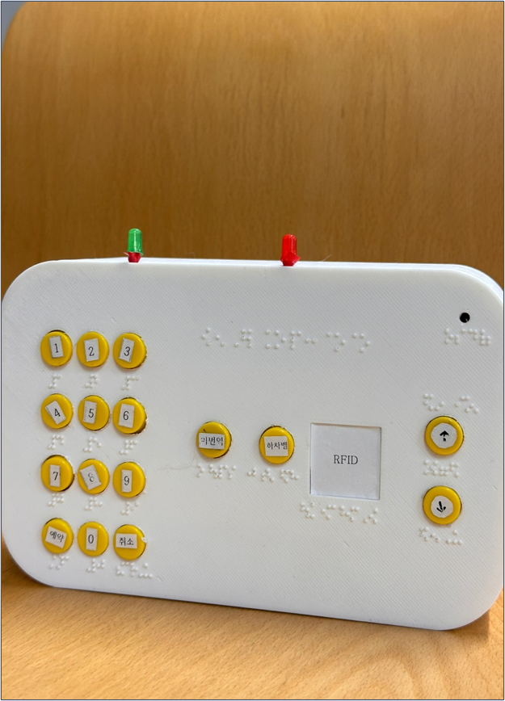
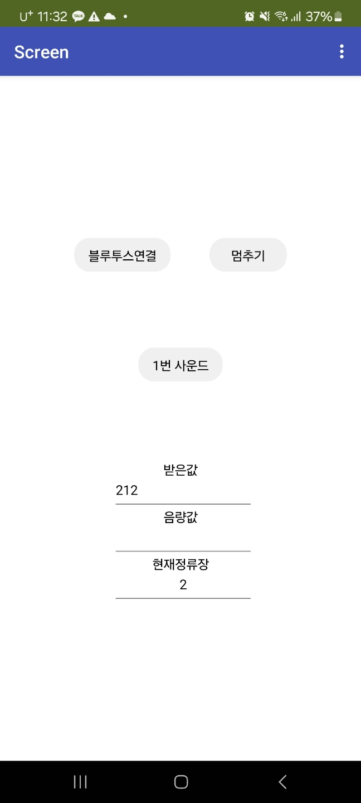
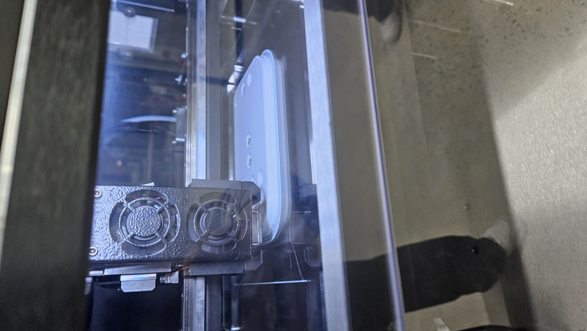

# 🔊 Sound Aid - 시각장애인을 위한 스마트 버스 안내 시스템

시각장애인이 버스를 이용할 때 겪는 불편함을 해소하기 위한 Arduino 기반 스마트 안내 시스템입니다.

## 📋 프로젝트 개요

Sound Aid는 시각장애인이 버스 정류장 정보를 쉽게 확인하고 하차할 정류장을 예약할 수 있도록 돕는 장치입니다. 블루투스 통신을 통해 스마트폰 앱과 연동되어 음성 안내 서비스를 제공합니다.

## ✨ 주요 기능

### 🎵 볼륨 조절

- **볼륨 업/다운 버튼**: 음성 안내의 볼륨을 0-10 단계로 조절 가능
- 실시간 볼륨 조절로 주변 환경에 맞는 최적의 음량 설정

### 🚏 정류장 안내

- **현재 정류장 확인**: 버튼 하나로 현재 위치의 정류장 정보 확인
- **자동 정류장 업데이트**: 5초마다 자동으로 다음 정류장으로 이동 (시뮬레이션)

### 📍 하차 예약 시스템

- **키패드 입력**: 4x3 키패드를 통한 정류장 번호 입력
- **예약 기능**: '#' 키로 원하는 정류장 예약
- **예약 취소**: '\*' 키로 예약 취소
- **도착 알림**: 예약한 정류장 1정거장 전 알림음과 LED로 알림

### 🔔 하차 벨 시스템

- 하차 버튼으로 기사에게 하차 의사 전달
- LED와 부저를 통한 시각/청각 피드백

## 🛠️ 하드웨어 구성

### 사용된 부품

- **Arduino**: 메인 컨트롤러
- **HC-06 블루투스 모듈**: 스마트폰과의 무선 통신
- **4x3 키패드**: 정류장 번호 입력
- **버튼**: 볼륨 조절, 현재 위치 확인, 하차 벨
- **LED**: 상태 표시
- **부저**: 알림음 출력

### 핀 배치

```cpp
// 메인 기능 버튼
#define SOUND_UP_BUTTON 7     // 볼륨 업
#define SOUND_DOWN_BUTTON 8   // 볼륨 다운
#define NOW_BUS_STOP 3        // 현재 정류장 확인
#define Stopover 4            // 하차 버튼

// 출력 장치
#define Stopover_LED 5        // 하차 LED
#define Keypad_LED 6          // 키패드 LED
#define buzzer 11             // 부저

// 블루투스 통신
#define TXD 10
#define RXD 9
```

## 📱 통신 프로토콜

블루투스를 통해 다음 데이터를 전송합니다:

| 데이터      | 설명                           |
| ----------- | ------------------------------ |
| `0-10`      | 볼륨 레벨                      |
| `300-304`   | 현재 정류장 번호               |
| `400`       | 현재 정류장 정보 요청          |
| `201-212`   | 키패드 입력값                  |
| `하차 거리` | 예약 정류장까지 남은 정거장 수 |

## 🎯 작동 원리

1. **전원 켜기**: 시스템 초기화 및 블루투스 연결 대기
2. **정류장 예약**: 키패드로 원하는 정류장 번호 입력 후 '#' 키 누름
3. **자동 안내**: 5초마다 정류장이 변경되며 예약 정류장 접근 시 알림
4. **하차 준비**: 목적지 1정거장 전 부저와 LED로 알림
5. **하차**: 하차 버튼으로 기사에게 하차 의사 전달

## 📸 프로젝트 사진


_완성된 Sound Aid 장치_


_연동되는 스마트폰 앱_


_장치 외관 제작 과정_


_키패드 제작 과정_


_3D 프린터를 이용한 케이스 제작_


_시스템 테스트 과정_

## 🔧 설치 및 사용법

### 1. 하드웨어 연결

- Arduino와 각 부품을 핀 배치도에 따라 연결
- HC-06 블루투스 모듈을 TXD(10), RXD(9)에 연결

### 2. 소프트웨어 업로드

```bash
# Arduino IDE에서 Botton_Soundaid(new).ino 파일 열기
# 보드: Arduino Uno 선택
# 시리얼 포트 선택 후 업로드
```

### 3. 블루투스 페어링

- 스마트폰에서 HC-06 모듈과 페어링
- 기본 PIN: 1234 또는 0000

### 4. 사용 방법

- 볼륨 조절: 볼륨 업/다운 버튼 사용
- 정류장 예약: 키패드로 번호 입력 후 '#' 키
- 예약 취소: '\*' 키
- 현재 위치 확인: NOW_BUS_STOP 버튼
- 하차: Stopover 버튼